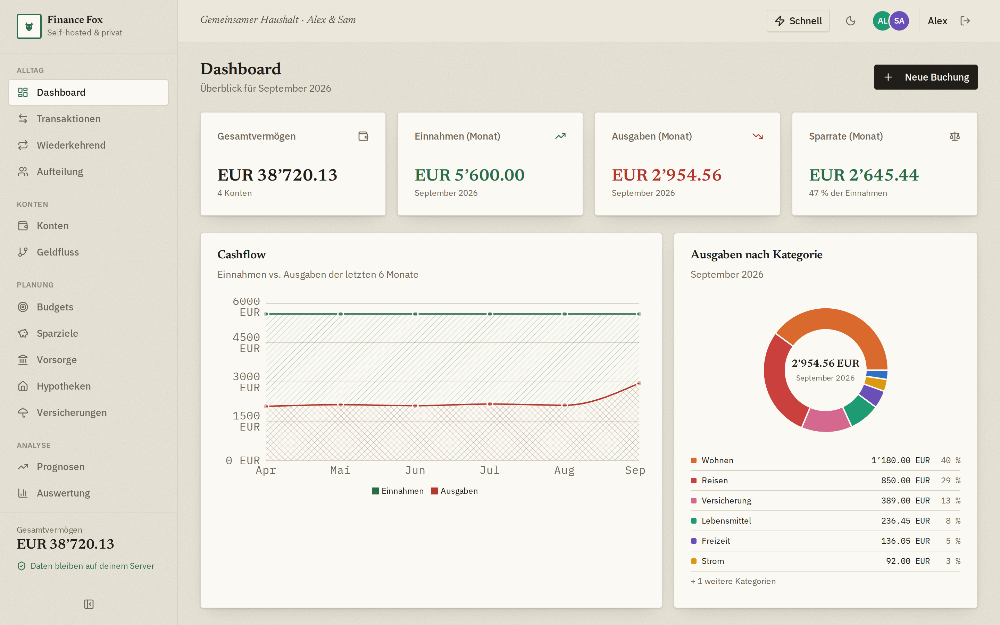
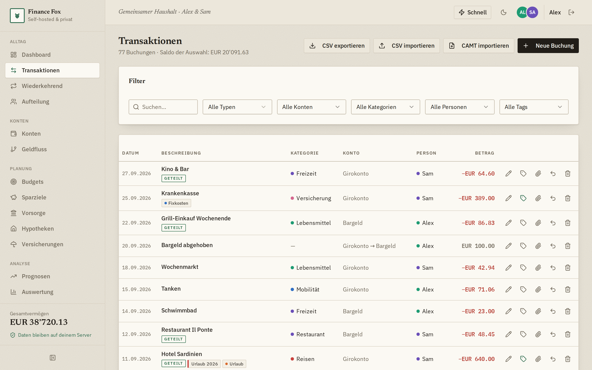
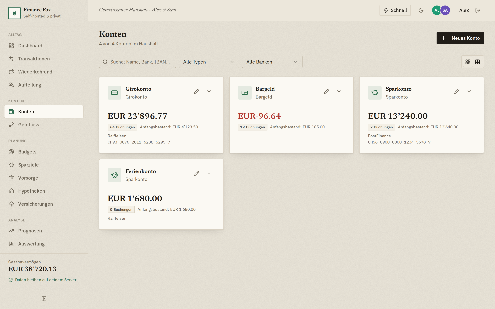
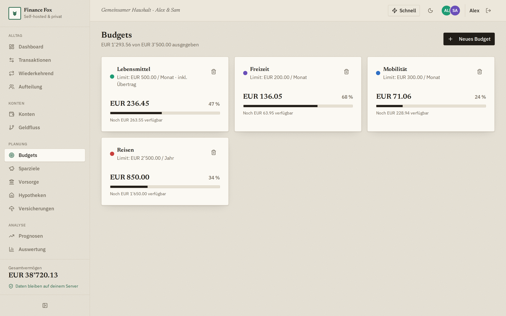
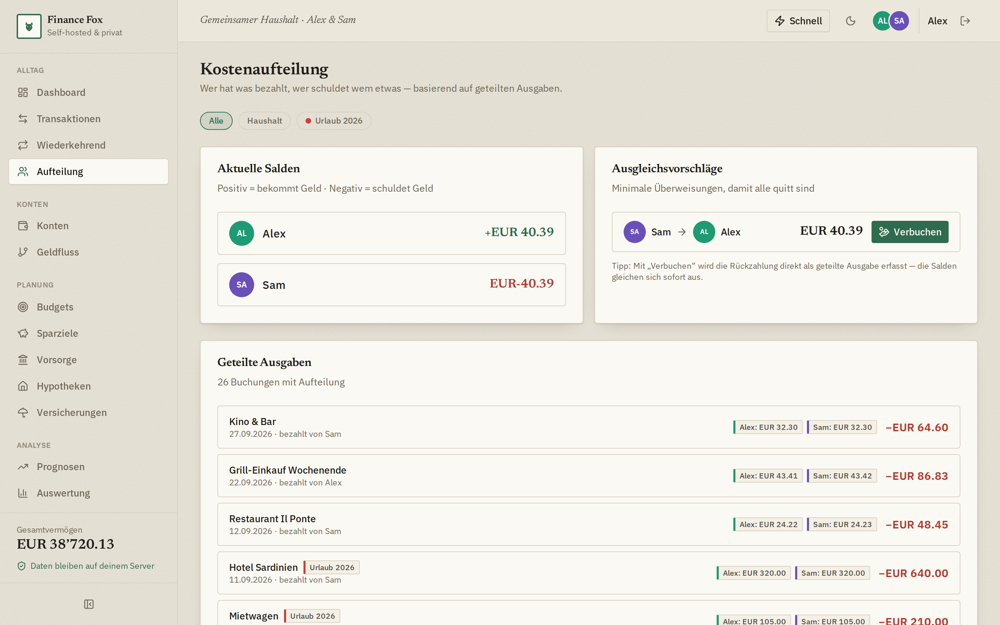
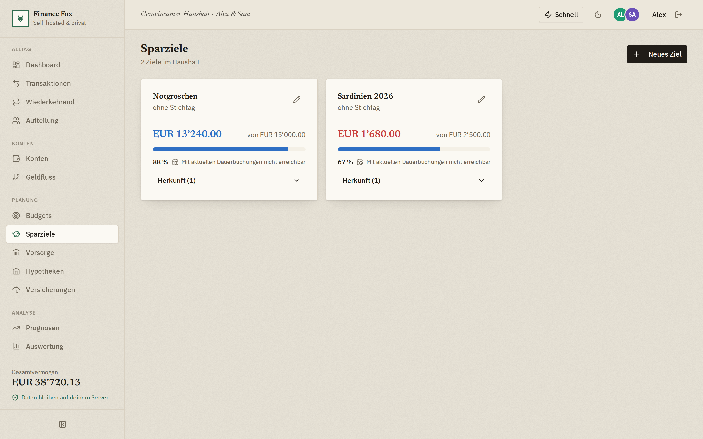
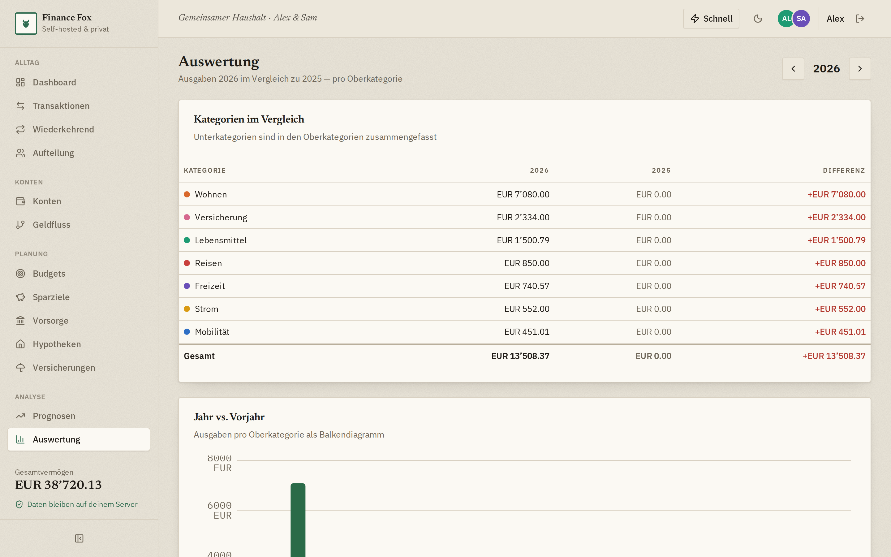
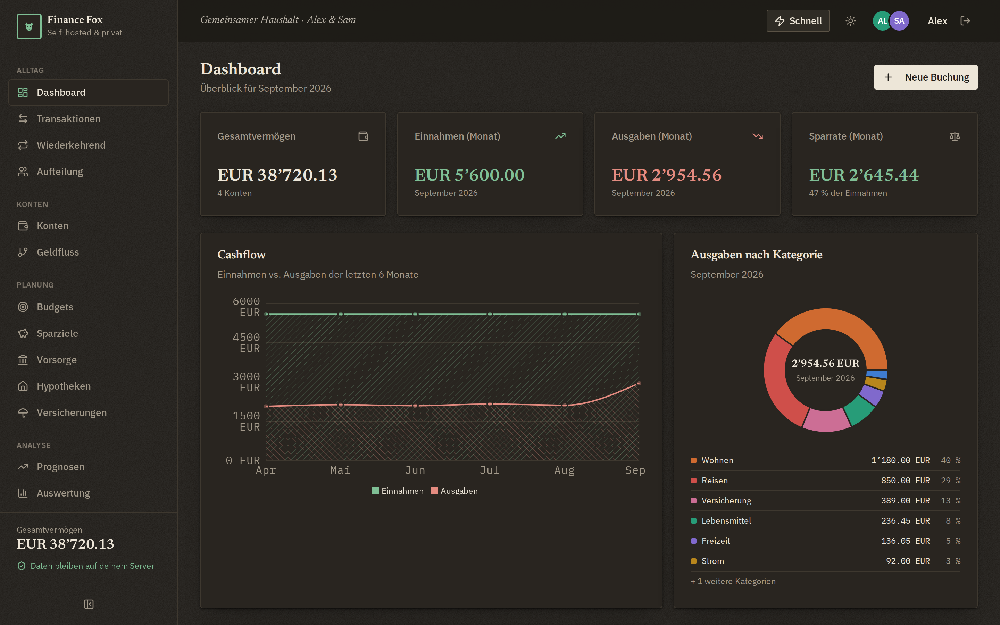
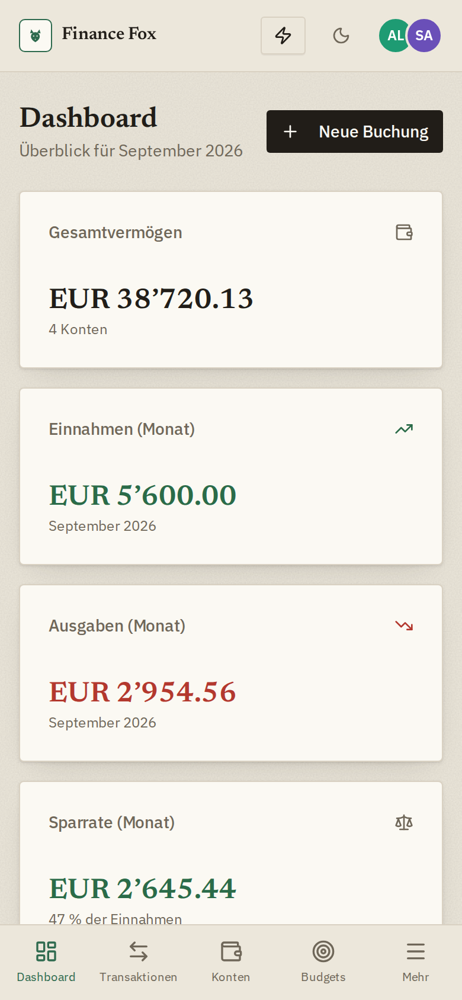

# Finance Fox

Self-gehostete Full-Stack-Webapp zur Organisation der Finanzen eines Haushalts
mit einer oder mehreren Personen. Alle Daten liegen in einer **SQLite-Datenbank
auf deinem eigenen Server** — nichts verlässt dein Netz.

## Funktionen

- **Dashboard** — Gesamtvermögen, Einnahmen/Ausgaben, Sparrate, Cashflow- und Kategorien-Charts
- **Transaktionen** — Einnahmen, Ausgaben, Umbuchungen; Suche & Filter, Tags, Beleg-Anhänge (Foto/PDF), Bearbeiten mit Änderungshistorie, CSV- & CAMT.053-Import, CSV-Export
- **Konten** — eigene Kontotypen, Bank & IBAN, Saldo-Verlauf, Besitz & Sichtbarkeit (privat vs. Gemeinschaftskonto mit Freigaben, serverseitig durchgesetzt)
- **Budgets** — Monats- oder Jahreslimits pro Kategorie mit Fortschritt, Warnung und optionalem Rollover
- **Kostenaufteilung** — Ausgaben splitten (auch gewichtet über Vorlagen), Projekte, Salden, Ausgleichsvorschläge mit 1-Klick-Verbuchung
- **Wiederkehrende Buchungen** — wöchentlich bis jährlich (auch viertel- und halbjährlich), inkl. Dauer-Umbuchungen; der Server verbucht Fälliges **täglich per Cron-Job** (03:00 Uhr) und bei jedem Start
- **Sparziele** — Fortschritt aus verknüpften Konten (ganzes Konto / fixer Anteil / Prozent), Herkunfts-Aufschlüsselung, ETA-Prognose
- **Prognosen & Auswertung** — Kontostand-Prognose, Budget-Hochrechnung, Sparziel-ETA, Szenario-Planung, Jahresvergleich; dazu eine **Prognose-Tabelle** mit frei wählbarem Horizont (bis 10 Jahre) und Spaltenbreite (Monat/Quartal/Halbjahr/Jahr) für Kontosalden, Sparziel-Fortschritt, Ein-/Ausgaben und Nettovermögen — optional inklusive dem Durchschnitt der variablen Buchungen
- **Hypotheken** — Liegenschaft mit Verkehrswert, mehrere Tranchen (Festhypothek/SARON/variabel) mit eigenem Zinssatz und Ablauf, direkte und indirekte Amortisation, Belehnung und Tragbarkeit nach Schweizer Praxis, Schuldenverlauf und Nettovermögen; Zins und Amortisation per Klick als Dauerbuchung, Erinnerung vor Ablauf der Zinsbindung
- **Versicherungen** — alle Policen des Haushalts zentral (gemeinsame wie personenbezogene): Sparte, Prämie, Selbstbehalt, Deckungen als freie Zeilen („wofür bin ich versichert?"), Dokumente, Angebote zum Vergleich; Vergleichsansicht für bis zu vier Policen nebeneinander, regelbasierter Deckungs-Check auf Lücken, Erinnerung vor Ablauf der Kündigungsfrist, Prämie per Klick als Dauerbuchung
- **Vorsorge (privat pro Benutzer)** — Schweizer 3-Säulen-Prinzip: Lohn & Abzüge (fix oder monatlich variabel), **AHV mit echter Rentenberechnung** (Rentenformel nach Art. 34 AHVG, Beitragsjahre aus dem IK-Auszug, Rentenskala und Beitragslücken, Erziehungs- und Betreuungsgutschriften, flexibler Rentenbezug mit Vorbezug/Aufschub/Teilrente im Variantenvergleich, 13. Altersrente, Plafonierung für Ehepaare und Einkommensteilung nach beidseitiger Verknüpfung), Pensionskasse, Säule 3a mit Dokument-Anhängen, Änderungshistorie und Altersprognose (Kapitalentwicklung, Rente, Ersatzrate); optional mit Konten verknüpfbar, Nettolohn per Klick als Dauerbuchung
- **Bericht (Export)** — Konten und ihre Verwendung als Dokument zum Mitnehmen ins Bank- oder Beratungsgespräch: frei wählbare Abschnitte (Konten, Sparziele, Hypotheken, Vorsorge, Versicherungen, Cashflow der letzten 12 Monate, Fixkosten, Nettovermögens-Prognose) als **PDF-Bericht** oder als **Excel-Mappe** mit einem Blatt je Abschnitt und Beträgen als echten Zahlen. Beide Formate entstehen serverseitig ohne zusätzliche Abhängigkeit
- **Benutzer & Login** — Ersteinrichtungs-Wizard, E-Mail/Passwort-Login, optionale 2FA (TOTP), Einladungslinks, Admin-Verwaltung, Aktivitäts-Log
- **Rundherum** — Benachrichtigungen (opt-in, ntfy/Webhook), Backup/Restore, Dark Mode, PWA, Zahlen- und Datumsformate nach Systemregion, 20 Währungen

## Screenshots















| Dark Mode | Mobil |
|---|---|
|  |  |

## Architektur

- **Frontend**: React 19 + TypeScript + Vite + Tailwind + shadcn/ui + Recharts
- **Backend**: Hono + tRPC (End-to-end typisiert), Sessions via signiertem HttpOnly-Cookie
- **Datenbank**: SQLite über sql.js (WebAssembly, Drizzle ORM) — eine Datei,
  ideal fürs Self-Hosting; keine nativen Module, kein Compile-Step beim Installieren
- **Hintergrundjobs**: node-cron (tägliche Verbuchung wiederkehrender Transaktionen)
- Alle Geldbeträge werden intern in Cent (Integer) gespeichert.

## Self-Hosting auf dem Heimserver

### Docker (empfohlen)

```bash
# Optional: eigenes Secret setzen
export JWT_SECRET="$(openssl rand -hex 32)"
export PUBLIC_URL="http://192.168.1.10:8080"   # so erreichst du die App im Heimnetz

# Variante A: fertiges Image von ghcr.io verwenden (empfohlen)
docker compose pull
docker compose up -d

# Variante B: Image lokal bauen
docker compose up -d --build
```

Die App läuft danach unter `http://<heimserver>:8080`.
Die Datenbank liegt im Docker-Volume `finance-fox-data` —
für Backups genügt es, dieses Volume (bzw. die `.db`-Datei) zu sichern.

**Einladungs- und Passwort-Reset-Links** werden im Container-Log ausgegeben:

```bash
docker logs finance-fox
```

### Ohne Docker

```bash
npm ci
npm run build
JWT_SECRET="langer-zufallsstring" PUBLIC_URL="http://localhost:3000" npm start
```

## Ersteinrichtung

1. App im Browser öffnen → der **Setup-Wizard** startet automatisch
2. Administratorkonto anlegen (Name, E-Mail, Passwort)
3. Weitere Haushaltsmitglieder einladen (Einladungslink kopieren oder aus dem Log holen)
4. Optional: lokale Daten aus der alten App-Version (localStorage) importieren

## Entwicklung

```bash
npm install
npm run db:push   # Schema anwenden
npm run dev       # http://localhost:3000 (Frontend + API mit HMR)
```

Wichtige Befehle: `npm run check` (Type-Check), `npm run build` (Produktion),
`npm run db:push` (Schema synchronisieren).
